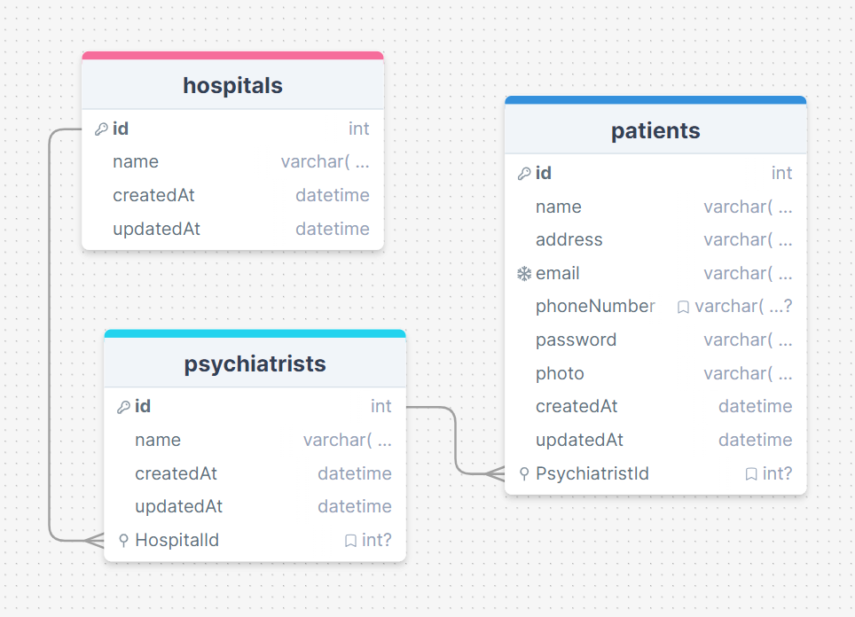

# Database Folder

This folder contains the structure and data dump file for the database.

## Database Schema

### Tables

#### Hospital
- `id` (INT, Primary Key, Auto Increment)
- `name` (VARCHAR(255))

#### Psychiatrist
- `id` (INT, Primary Key, Auto Increment)
- `name` (VARCHAR(255))
- `HospitalId` (INT, Foreign Key references Hospital(id))

#### Patient
- `id` (INT, Primary Key, Auto Increment)
- `name` (VARCHAR(255))
- `address` (VARCHAR(255))
- `email` (VARCHAR(255))
- `phoneNumber` (VARCHAR(20))
- `password` (VARCHAR(255))
- `photo` (TEXT)
- `PsychiatristId` (INT, Foreign Key references Psychiatrist(id))

## Schema Diagram

